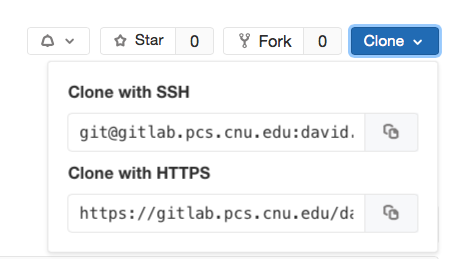
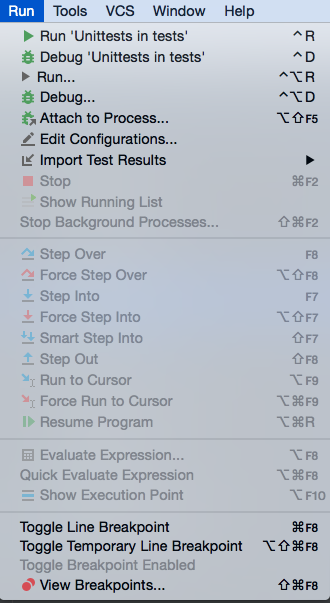
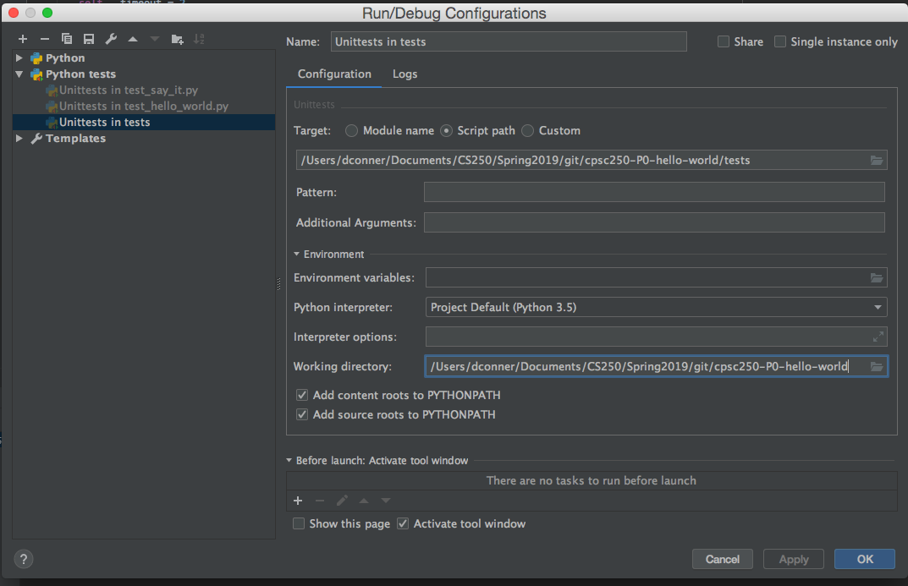

# Overview

This project modifies the simple hello world example as we demonstrate the workflow and tool chain that we will use in lecture and lab this semester.  Learning these tools is part of your professional development, and is required for this course; you are expected to master this workflow.

Students are required to demonstrate forking and cloning this project using Gitlab and Git.
Then creating a PyCharm project that points to this project, and modifying the code as directed.  Grading occurs in two parts:
1. The code will be automatically tested by WebCat (25 points)
   * Check your WebCat page to verify points (this is the grade that counts)
   * Due on WebCat by posted due date
2. Bring your personal laptop to my office hours and demonstrate all tools working on your personal machine. (25 points)
   * Contact me if you do not have a laptop.
   * Due my office by next Tuesday by end of office hours

****
GitLab Setup
====

We have created a personal Gitlab group for you to use in this class following the `firstname.lastname.yy-cpsc250-semesterYear` convention.  
Your lecture and lab instructors are members of this group, and can view all of your projects in this group.  
You are required to use this group for all assignments in the course.

Be sure to update your `WCUSER` and `WCPASS` variables on your personal `firstname.lastname.yy-cpsc250-semesterYear` **group**
so that your code is submitted to WebCat with your user ID and password.  
See the lecture slides for details on updating these variables.

Doing this once for the **group** will work for all projects submitted to this group for both lecture and lab.
It is your responsibility to verify that your code is on WebCat and successfully passed the required tests.

If you change your password on WebCat, then be sure to update the `WCPASS` variable on your *group*.  

You may use your personal computer for this initial work, or if you do not *YET* have the software installed, then use the lab machines with the ``PCSE_user`` and no password.


Projects in CPSC 250 will have common structure.
```
cpsc250-<project ID>
|-src   (source files that you will modify)
|-tests (provided unit test files that you should NOT modify)
|-data  (optional folder for provided data for processing - do NOT modify)
|-docs  (optional folder for instructions and documentation - do NOT modify)
|-exam  (optional folder that may contain exam ID information - do NOT modify)
|-given (optional folder for instructor provided code - do NOT modify)
|-img   (optional folder for images used in README and documents - do NOT modify)
```

All of your changes should be to files in the `src` folder; **do not modify or move files in the other folders.**

****
Setting up the project
====

Fork this repository into your personal group (with name of the form `firstname.lastname.yy-cpsc250-semesterYear`).
After the fork completes, you will be at a repository in that group.
Check the URL for your group name to verify.

Once the fork is
done, select the `Clone` dropdown menu, and click the double file button to right of URL (web) address under `Clone with HTTPS` as shown in



Clicking the icon copies the entire address into the computer *clipboard* memory.
Open up Git Bash, `cd` into
`cpsc250` (make that directory using `mkdir` if it does not exist).
Use `pwd` to verify that you are in the correct directory.

> NOTE: This assumes GitBash is installed.  See the [tool chain](docs/toolchain_setup.md) setup directions for installing the necessary software on your personal machine.

> NOTE: On the lab machines, the terminal may open in the `/bin` folder which is read only.
In this event, change to your home directory by using the command (with tilde mark):
```
cd ~
```

Git needs to know who to give credit to when you make a commit; therefore, we need to set our Git *credentials*.  From the GitBash shell, type:
```
git config --global user.name "Full Name"
git config --global user.email "first.last.yy@cnu.edu"
git config --global credential.helper 'cache --timeout=1800'
```
**NOTE: Pay attention to the single and double quote marks around the text.**

The latter command saves you from repeatedly needing to type your password for multiple *pushes* to the remote. The 1800 is seconds, which corresponds to a half hour.

You will need to set these credentials every time you log into the `pcse_user` account on a lab machine.  You only need to do this once on your personal machine, unless you are switching partners during a pair programming exercise.


From your designated `cpsc250` folder, type  `git clone ` followed by a space and paste the URL of your forked repository.
Before pressing enter, ensure that your group name is in that URL.   
If it is, press enter.

> NOTE: Different machines have different commands for `PASTE`;
> most often `Ctrl-v` (`Command-v` on Mac), or
> right click and select `Paste` from menu, works.

> NOTE: A common error is to forget to *fork* and clone the project from the student distribution group.
> If this happens all is not lost, you can `git remote add mine <URL>`.  This adds an additional remote called `mine` in addition to the default `origin`.
 Just remember to substitute `mine` where you see `origin` in the below commands.

If the clone fails, *read the error message carefully* and try again.
* If the Gitlab remote is unreachable on lab machines, you may need to reboot the lab laptop.
* On Windows machines, you may need to reset the Credential Manager if your login credentials changed or were entered incorrectly.  

> NOTE: To reset credentials on Windows, hit Windows button, and type `Creden` and you should see the `Credential Manager` application pop up.  Select it, select `Windows Credentials` and remove the credential associated with Git.

If it fails to clone after 3 tries, immediately
ask your instructor for assistance.

Once the clone succeeds, `cd` into the cloned directory.

Use `pwd` to determine the full path to this repo,
and use `ls -altr` to view the contents of the folder.

****
PyCharm Setup
====

PyCharm is an *Integrated Development Environment* (IDE) for Python.
PyCharm is an *Integrated Development Environment* (IDE) for Python.  It is installed on the lab machines; we will provide setup directions for your personal machine later.


Start the PyCharm IDE; the main page will start at the project selection menu.

Select `Open Project` and browse to the folder where you just cloned the repo.

> NOTE: Always `Open` the cloned repo folder.  
> Do NOT copy files around because you are editing in a different folder than your git repo.
> Do NOT create a `New` project; always `Open` in CPSC 250.


In order to consistently run our unit tests in PyCharm and on GitLab/WebCat, we need to make a change to the PyCharm configuration for each project.

From the main PyCharm menu, select `Run` and then `Edit Configurations` as shown in
.

Then edit the `Working Directory` at the bottom of the `Run/Debug Configurations` dialog to remove the `tests` folder so that the working directory points to the main repo as shown in  
, and select `OK`.

> NOTE: The Edu edition of PyCharm requires jumping through some hoops to expose the `Run` menu required to set the Working directory.  Using the `Community Edition` simplifies our life.


We are now ready to start coding.

****
Project Coding Exercises
====

### Exercise 1

Modify the simple print statement in `hello_world.py`.

First create a method called `say_hello()` that returns the string "Hello World!".
```python
def say_hello():
    """
        Specify a string
        @return string
    """

    return "Hello World!"

```
This basic method just defines a string.  This example includes a doc string to provide a description of the method.

Call this method from within the script.
```python
print(say_hello())
```
For now, your file should only have the `say_hello()` method and the single `print` command.

Right click on the `hello_world.py` file and select `Run hello_world`.
You should see the string printed to the console window that is part of PyCharm.

Open a terminal with current directory corresponding to the project, and `cd src` to change into the source folder.
Run `python hello_world.py` from the command line.  Again you should see the `Hello World!` output.

Now, again from PyCharm, right click on the `hello_world_test.py` and run the unit tests.
This will verify that the method is named correctly, and the output is exactly as specified.

After debugging and completing the last change for this exercise, open a (GitBash) terminal, change to the project folder,
and verify the changed file:
```
git status
```

View the changes:
```
git diff
```

Doing the `status` and `diff` checks is optional, but is helpful to verify that you are making changes in the correct folder.

Commit the changes to the local repository:
```
git commit -am "implemented say_hello"
```
This commits *a*ll changes to tracked files, and adds the *m*essage in quotes.
This `commit` command records your changes to your *LOCAL* repository on your current machine.

You are free to make additional commits, but be sure to include this commit.

Push your committed changes from your local repo to the remote repository on our PCSE Gitlab server.
```
git push origin master
```
The `push` command records your *commits* from your local repo to the remote server.

Be sure to make at least one commit and one push *EVERY* time you work on coding;
**if you aren't pushing you aren't working on code in CPSC 250!**

**If it is not on GitLab, it didn't happen.**

The remote server is named "origin" by default, and "master" is the default branch name.  
For now, we will stick with these default branch names.  
We will explain branching later in the semester.


### Exercise 2

Import `hello_world.py` into  the `say_it.py` script, and call the `say_hello` method inside a print statement.

```python
import hello_world
print(hello_world.say_hello())
```


Now run the `say_it.py` script from within PyCharm, *AND* from the command line as above.
You should see `Hello World!` printed twice!

By default, scripts run when imported into another script.
Modify the `hello_world.py` script to use the `main` construct so that "hello world" is only printed once.

```python
if __name__ == '__main__':

    print(say_hello())


```
This change only runs the print command if the script is executed as `main`, which is not the case when it is imported into another script.

Now re-run the `say_it.py` script in PyCharm *AND* on the comand line;
you should only see one `Hello World!` on the screen each place.

Now run the `say_it_test.py` unit test.

After verifying the correctness,
```
git commit -am "called say_hello from say_it.py"
```
You are free to make additional commits, but be sure to include this commit.

Push your changes to the remote server.
```
git push origin master
```

****
GitLab Continuous Integration
====

Each project contains a ```.gitlab-ci.yml``` file that specifies code that is automatically executed on the Gitlab server with each push.  This may include unit tests and the code that automatically uploads the modified files to WebCat for grading.

This file starts with a ``.`` which means that it is hidden from the file browser by default.
You should NOT modify  this file.

Go to the project webpage on your forked repo, and view the status report for the tests.   (See lecture notes for detailed instructions.)

Verify that the code was automatically uploaded to WebCat.  The most common problem is issues with the ``WCUSER`` and ``WCPASS`` variables set for your personal GitLab *GROUP*.

After setting the `WCUSER` and `WCPASS` variables, you will need to re-trigger the WebCat submission task as shown in the lecture notes.

From now on, for any project on your personal group, every push to GitLab will automatically submit to WebCat.

****
WebCat Automated Grader
====

Your grade is determined by WebCat based on unit tests.  For most cases, these are the same unit tests distributed with each project.  In some cases, additional tests may be executed by WebCat.
Your code must be individually submitted to WebCat for credit.  

Verify that your code reached WebCat by logging into WebCat directly and viewing your score as shown in the lecture notes.

See your instructor immediately if you are having issues with WebCat.

****
Install software and visit instructor
====

Success in this course requires frequent practice.  By using Gitlab, it is possible to successfully do all of your work in the classrooms and Hunter Creech, but it is easiest if you have access at home.

Half of the credit for this project requires visiting your instructor and demonstrating that you have this tool chain installed and functioning on your computer.

Obviously, this requires setting up the software on your personal machine first.

See [tool chain](docs/toolchain_setup.md) for directions.

Try it yourself, but see your instructor or lab instructor for help early.

If you do not have a personal machine, or only have a desktop, then contact your instructor prior to the due date for alternate instructions.

> NOTE: If you do your work on different machines, you will need to get in the habit of doing a `git pull` at the start of every session.
> When you first clone a project this is not necessary, but once you are set up on different machines,
> you need to `git pull` to get your local repo up to date **BEFORE** making changes.
> Otherwise, you will not be able to push to GitLab. If you `git pull` after making changes, you may get *merge conflicts* that must be cleaned up.
> See you instructor for assistance if this happens to you.
